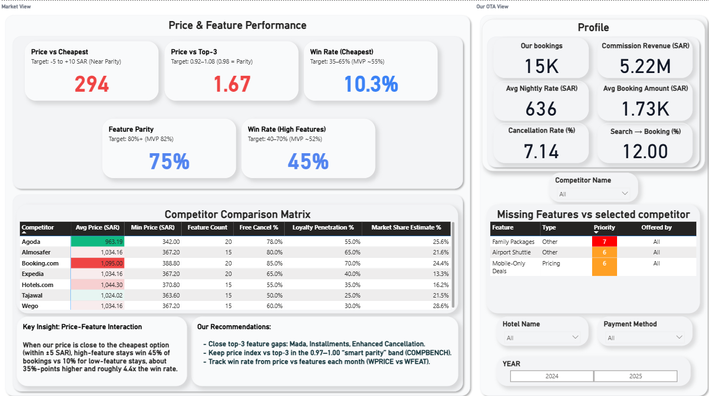
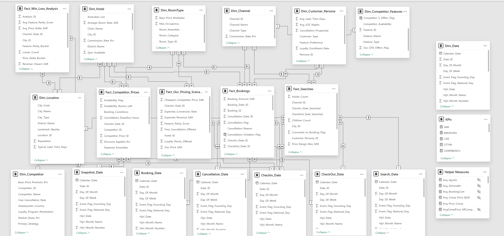

# Hotel OTA Analytics — Saudi Arabia Market Entry
**End-to-End Analytics Project · Python · Power BI · DAX**

A full-stack analytics project simulating an OTA entering the Saudi hotel market. Covers the entire data pipeline: synthetic data engineering → relational data model → interactive business dashboard.

> All 590,000+ records are fully synthetic — engineered to reflect real Saudi market behavior, with no real customer data involved.

---

## Dashboard Preview



> 🔗 **[View Interactive Report](https://www.novypro.com/profile_about/1776977774120x315201475654485200?Popup=memberProject&Data=1776977812993x310390965945152000)**

The dashboard is split into two views:
- **Market View** — Price & feature parity against competitors, win rate analysis, and a competitor comparison matrix with actionable recommendations
- **Our OTA View** — Core KPIs including bookings, commission revenue, cancellation rate, and search-to-booking conversion

---

## Data Model



A **star schema** built across 15 tables — designed for performance and analytical flexibility across multiple business domains.

| Layer | Tables |
|---|---|
| Fact tables | `Fact_Bookings`, `Fact_Searches`, `Fact_Competitor_Prices`, `Fact_Our_Pricing_Scenarios`, `Fact_Win_Loss_Analysis` |
| Dimension tables | `Dim_Hotel`, `Dim_RoomType`, `Dim_Channel`, `Dim_Customer_Persona`, `Dim_Competitor`, `Dim_Competitor_Features`, `Dim_Location`, `Dim_Date` |
| Date role-playing | 5 date dimensions (`Booking_Date`, `CheckIn_Date`, `CheckOut_Date`, `Cancellation_Date`, `Search_Date`, `Snapshot_Date`) |
| Measure tables | `KPIs`, `Helper Measures` |

25 DAX measures were implemented covering ARR, CAR, BRKEEVEN, CITYW, COMPBENCH, and more — with full formulas documented in `data/hotel_ota_kpi_catalog.csv`.

---

## Project Phases

### Phase 1 — Synthetic Data Engineering
590,000+ records generated from scratch using Python, with 31 business rules encoded to replicate real Saudi market dynamics:

- **Hajj (Jun 4–9):** Mecca bookings spike 3×
- **Ramadan (Feb 28–Mar 30):** All-city demand doubles
- **Riyadh:** Business-heavy, weekday-focused traveler profile
- **Mecca:** 80% religious travelers, long lead times
- **Cancellation ladder:** 5% early bookers → 20% last-minute

48 automated validation tests were run. All passed.

| Test Category | Result |
|---|---|
| Referential integrity (13 FK checks) | ✅ 100% |
| Date logic (booking ≤ check-in < check-out) | ✅ 100% |
| Seasonal multipliers (Hajj 3×, Ramadan 2×) | ✅ Confirmed |
| Search-to-book conversion | ✅ 12% (target: 10–15%) |
| Price vs. star rating correlation | ✅ r = 0.976 |

### Phase 2 — Data Model (Power BI)
Raw CSVs imported into Power BI and structured into the star schema above. Relationships, cardinalities, and role-playing date dimensions were configured to support complex DAX without ambiguity.

### Phase 3 — Dashboard (Power BI)
An interactive report built for an OTA analyst persona. Key analytical capabilities:
- Filter by competitor, hotel, payment method, and year
- Identify feature gaps vs. any selected competitor
- Track win rate against cheapest and top-3 competitors
- Monitor price parity in real time against market benchmarks

---

## Repository Structure

```
hotel-ota-synthetic-data/
│
├── spec/                           # Business rules & data blueprints
│   ├── FILE1_Data_Dictionary_Complete.csv
│   ├── FILE2_Referential_Integrity.json
│   ├── FILE3_Business_Logic_Rules.json
│   └── FILE6_Market_Calendar_2025.json
│
├── src/                            # Data generation scripts
│   ├── script_complete.py          # Generates all 12 CSVs
│   ├── generate_data_dictionary.py
│   ├── generate_kpi_catalogue.py
│   └── generate_table_summary.py
│
├── data/                           # Generated output — ready for Power BI
│   ├── hotel_ota_kpi_catalog.csv   # 25 KPIs with DAX formulas
│   ├── hotel_ota_tables_summary.csv
│   └── ... (12 generated CSVs)
│
└── validation/
    └── validation_results.csv
```

---

## Getting Started

```bash
pip install pandas numpy
python src/script_complete.py       # generates all 12 CSVs into data/
```

> Uses `random_seed=42` — output is fully reproducible.

To explore the Power BI report:
- 🔗 [View interactive dashboard](https://www.novypro.com/profile_about/1776977774120x315201475654485200?Popup=memberProject&Data=1776977812993x310390965945152000)
- 📥 Download the `.pbix` file directly from this repo to explore the data model and DAX measures in Power BI Desktop

---

## Dataset at a Glance

| | |
|---|---|
| Tables | 12 (3 fact + 9 dimension) |
| Total records | 590,000+ |
| Date range | Jan 2024 – Jun 2025 |
| Cities | Riyadh, Mecca, Jeddah |
| KPIs supported | 25 (with DAX formulas) |

---

## Tech Stack

Python · pandas · NumPy · Power BI · DAX

---

## Authors

Ahmed Atef Mohran & Mu'min Ahmed
